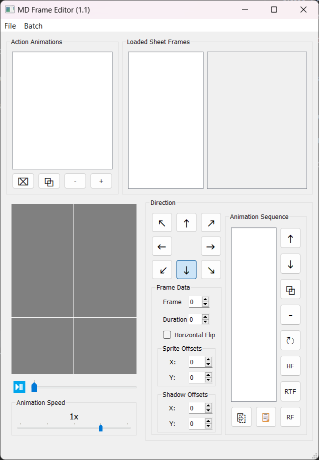

Simple frame editor to edit FrameData.xml and see results live instead of manually editing XML data and importing into your game.

Notes:
For an easier time, copy an existing FrameData.xml to use and modify. Also make sure the FrameWidth, FrameHeight XML datas are accurate for the sheet you are using.

Save Options:

Trim Copies: Instead of writing full animation data, will instead write an Animation Action as CopyOf data. If your program doesn't handle this scenario, leave unchecked to write all frame data.

Collapse Singles: If there is only one sequence that is the same for all 8 directions, it will save it as 1 sequence. If your program doesn't handle this scenario, leave unchecked to write all 8 sequences.

If you want to build yourself, you can do so via Pyinstaller: pyinstaller MDFrameEditor.spec

Download for a Windows version is provided.

1.1: 
Fix: The original of a copy is no longer set as a copy preventing copy loop.
Fix: No longer writes -1 as the index ID if it does not exist. It is omitted now.
Fix: Animation speed label no longer squashed on some display settings.
Change: Trim/Collapse save options are now default.
Add: Error message if OpenGL version is not supported.
Add: Image to readme.

1.0:
Initial Release

